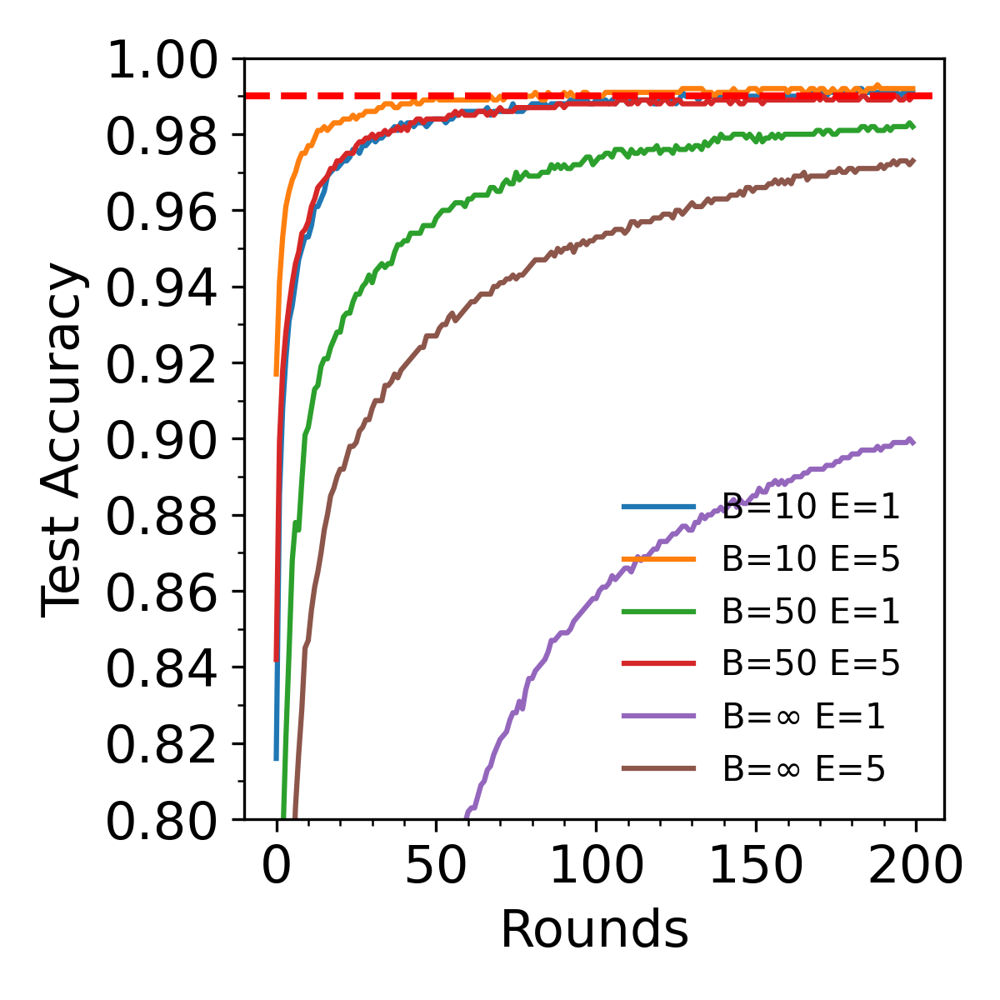
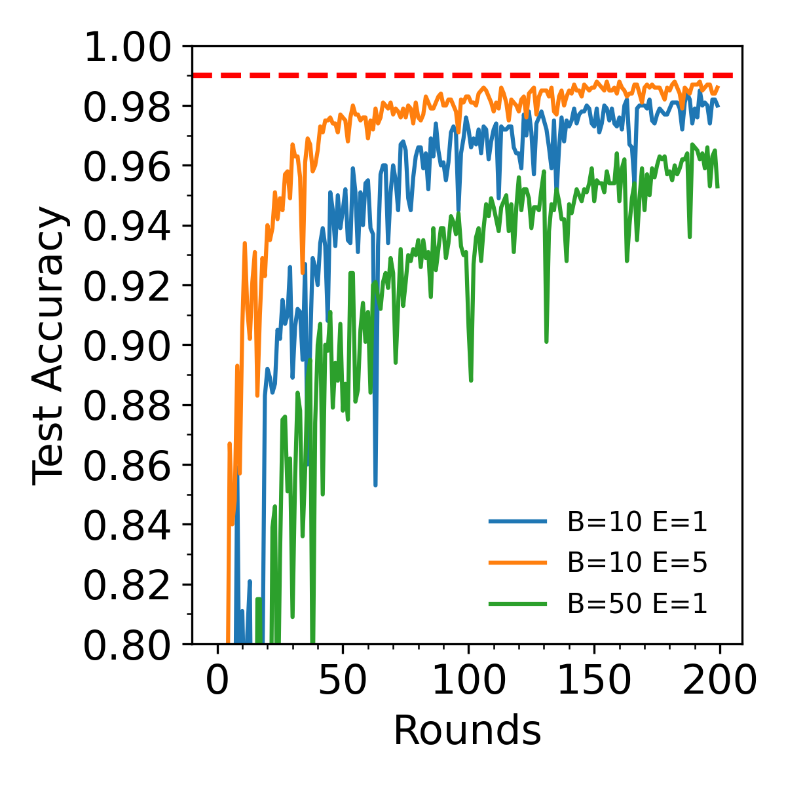
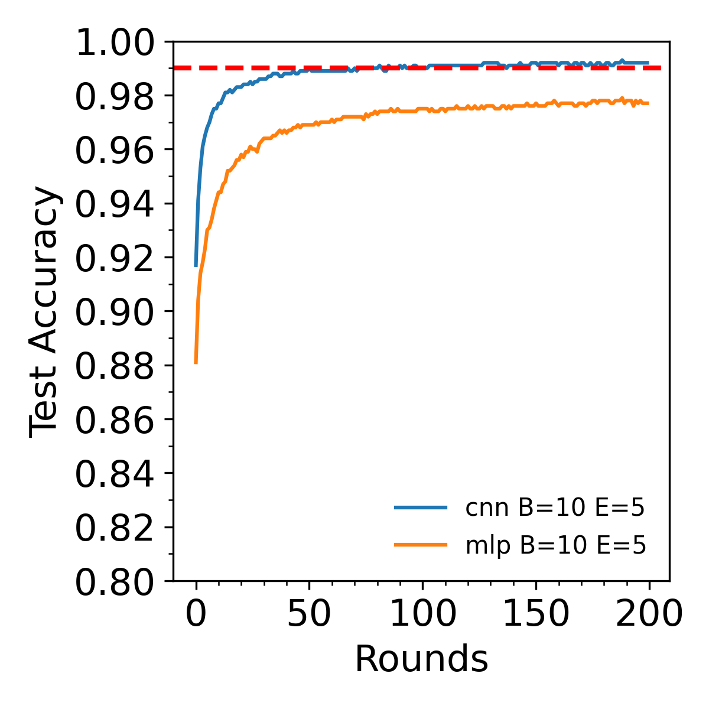

# Implementation of FedAvg

## Requirements
- Python3
- PyTorch
- Torchvision
- matplotlib
- pandas
  
To install all requirements, run:

`pip3 install -r requirements.txt`

## How to run an experiment
An example on running experiments:

`python3 src/main.py --arch=cnn --G=200 --B=50 --E=5 --iid=1 `

## Arguments
### Key Arguments
- --arch: architecture used, 'mlp' or 'cnn'
- --G: global round number
- --B: local batch size
- --E: local epoch number
- --iid: 1: iid data patrition; 0: non0-iid patrition
### Other Arguments
- --C: fraction of clients used, default : 0.1
- --K: number of clients, default is 100
- --lr: leaning rate, default is 0.01
- --verbose: control verbose details. default: 0.

## Experiment Setup and Results
### Setup
For all models, I use the same optimizer: `optimizer=sgd`, `lr=0.01` and `momentum=0.5`. The models share the same parameters: `K=100` and `C=0.`. Due to limited computation resources and time, models are trainied for only 200 rounds. 

### Results
#### 'cnn' on 'iid' data

#### `iid` vs `non-iid`

#### `mlp` vs `cnn`

- The test accuracy curve quickly reaches a plateau in most cases.
- It is clear that FedAvg outperforms FedSGD ( E = 1 and B = $\infty$).
- Performance on non-idd is worse than idd data, which is expected. But the performance on non-iid is still very high. This might be due to the simplicity of the problem investigated. 
- The CNN model works better than the MLP model.

## Discussion

- In the paper, it remains unclear how to calcualte the mean the client weights to get server weight. I use the average of weights of clients selected during a certain global round. Test accuracy curve flucturates a lot for the non-iid case, which might be due to the average strategy selected in my project is not that appropriate. A further study is required to illustrate this.
- An optimized learning rate is used in the paper. Since this optimized value is not mentioned, a fixed learning rate of 0.01 is used throughout the experiments. This should be considered in making interpretations. Regardless of this discrepancy, the general trend reproduced in this project is similar to the paper. 
- Although not strictly parallelized, the Clients are in the code are trainied sequentially but individually. This guarantees that the clients are dependent on each other.

## References:
- H. Brendan McMahan, Eider Moore, Daniel Ramage, Seth Hampson, Blaise Aguera y Arcas, Communication-Efficient Learning of Deep Networks from Decentralized Data, AISTATS 2017.
- https://github.com/AshwinRJ/Federated-Learning-PyTorch
- https://github.com/wuyenlin/federated-learning